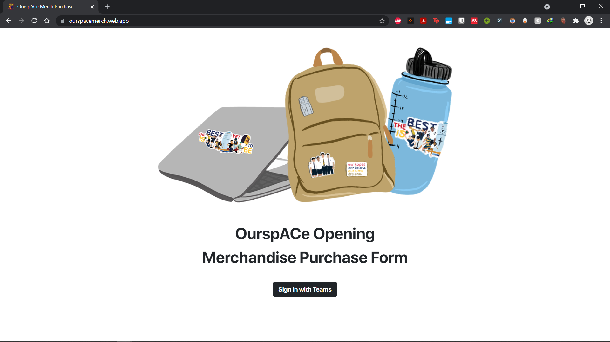
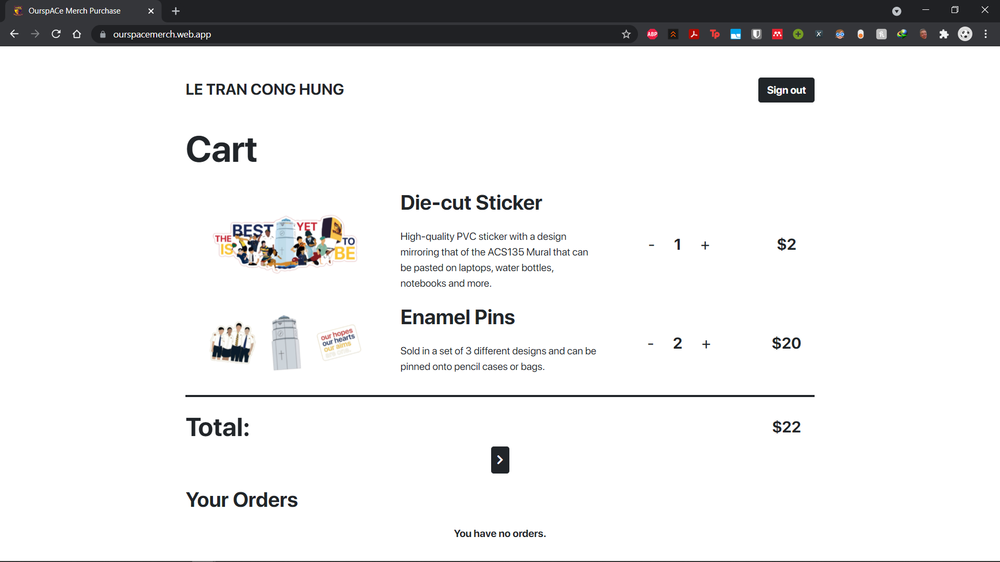
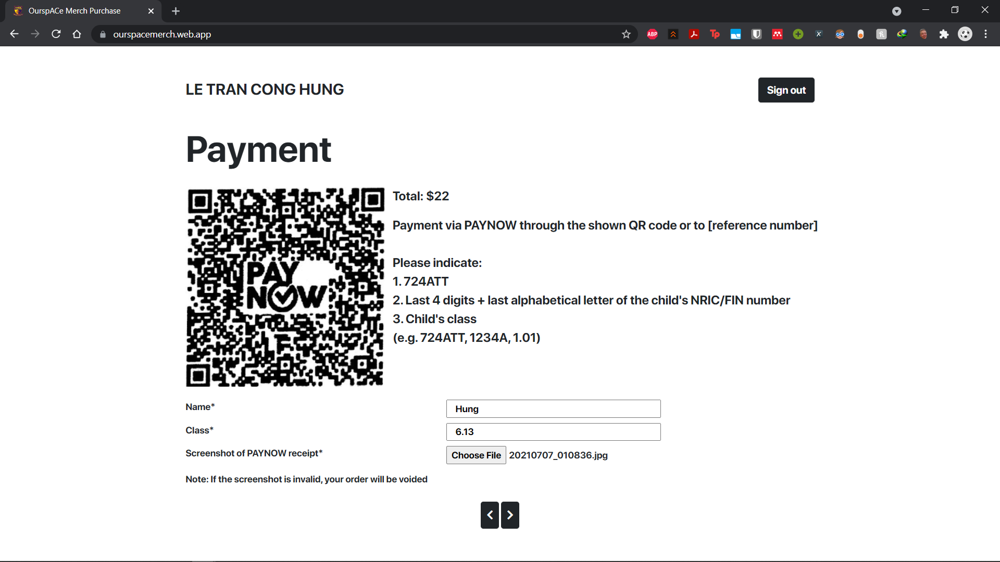
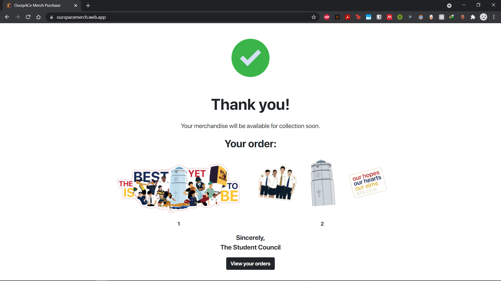
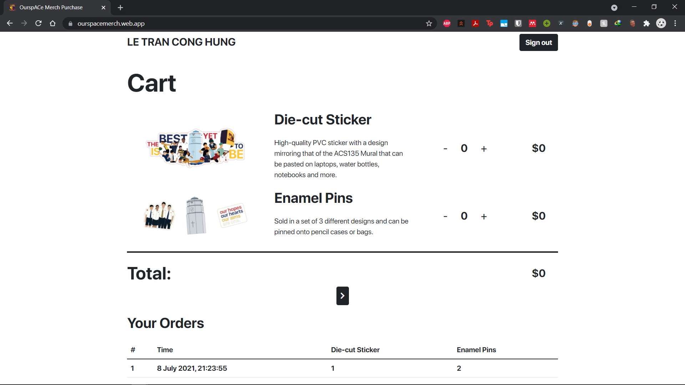
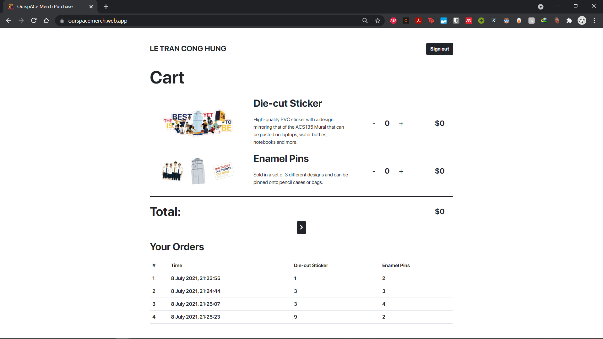

# OurspACe Merchandise Order Form
#### A 5-day fullstack VanillaJS + Firebase project

## Preface
This project was started as an initiative to simplify the payment process when the student body needs to pay the school, in this case, for a merchandise sales. Typically a hardcopy letter with the PAYNOW QR code/bank account reference number would have to be issued to the parents for payment collecting purposes. This traditional approach is severely crippling in this case, in which the payable amount varies from person to person, depending on the amount of merch that the student buys. Obviously, it is extremely laborious to customise each of these parent letters to a pool of buyers that can potentially amount up to 2000, 3000 students in the school.

Furthermore, each payment isn't directly linked to the purchase. Whether a person has made an appropriate payment to the school has to be verified by using their Teams ID to find the person's NRIC/FIN (database of which is clearly limited to only a certain number of people, therefore lacking the necessary speed to adapt to the scale of this operations), and matching it to the NRIC/FIN stated in the "note" section of the bank transfer (that the school has previously instructed the parents to include). This entire verification process would take a lot of time and efforts.

**With that, we aimed to simplify the process by making a website that every student can order, dynamically view the total payable amount and upload a screenshot of the bank transfer. In this way, purchase is connected to payment, and verification is as easy as inspecting the screenshots in in the database.**

## Web stack
- Front-end: Bootstrap.
- Back-end: VanillaJS + Firebase Authentication, Realtime Database, Storage, Hosting.

## Demo

#### Home screen with signing in through Teams, using Firebase Authentication with OAuth 2.0 to Microsoft and AzureAD

#### Cart

#### Payment

Images are then uploaded to Firebase Storage, while purchase records are uploaded to Firebase Realtime Database for "View Orders" feature.

#### End screen

#### View Orders

#### Orders are dynamically updated in realtime.

## Notes
In the end the project wasn't utilized due to the tight timeline and several security concerns from (relatively conservative and Microsoft-fan) teachers, which I think are definitely valid to a certain extent, considering that we are dealing with bank transfers here.

Indeed a bit sad, but from the start I already chose to embark on this project for fun, and took everything as a learning opportunity for myself. I actually learned so much about APIs, HTTP requests, web security and JS that will surely help me in future projects. Sleep depriving, stressful and tiring as it might be, this project also brought me so much joy and adrenaline, and is one that I will be very proud of.